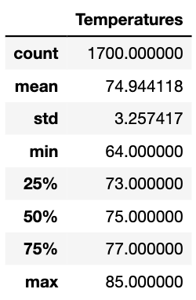
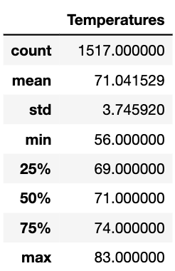

# Surfs_up

## Overview of Project 

### Purpose

The overall objective is to help W.Avy determine whether if surf and ice cream shops in Ohau sustainable year-round. We are to use tools such as SQLite, SQLAlchemy, and Flask to build on your knowledge of SQL database structures and querying methods. Using Jupyter notebook, we are to execute Python codes and create graphs to analyze the data.

## Results: 

June:

1. The highest temperature in June was 85 degrees.
2. The lowest temperature in June was 64 degrees.
3. The temperature average in June was 74.9 degrees.
4. The standard deviation is 3.25.

December

1. The highest temperature in December was 83 degrees.
2. The lowest temperature in December was 56 degrees. 
3. The temperature average in December was 71.04 degrees.
4. The standard deviation for December is 3.74

## Summary:

In conclusion, data suggests that surf and ice cream shop business are sustainable year-round in Ohau, Hawaii. The weather in both months roughly falls between 70- 75 degrees making it feasible to open up shops all year round.

One additional query that would be useful to his plan is to gather more data on foot traffic analysis near the location to see if it is a popular location to open in. Another additional query would be to gather more weather data for June and December from previous years and compare the data to get a more accurate analysis.